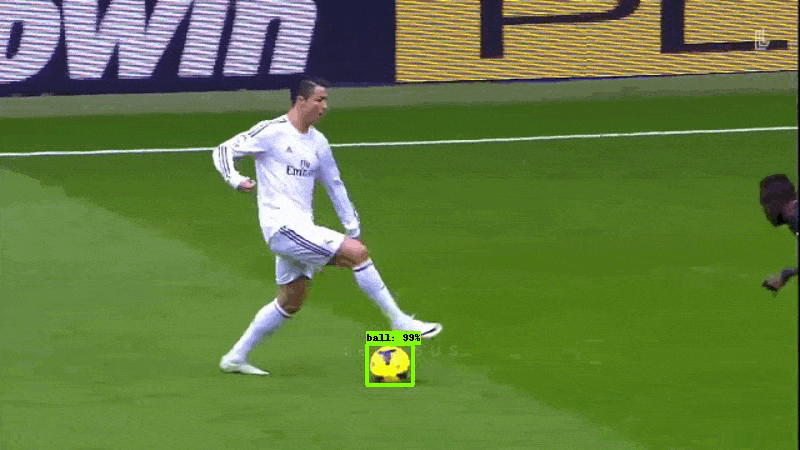
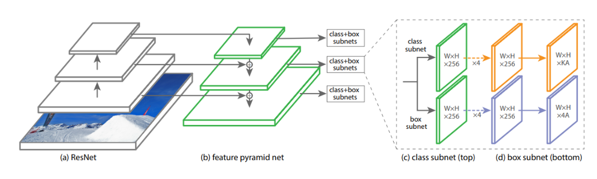

# Few-Shot Learning with Only 5 Images

In this repository, we leverage the power of few-shot learning combined with a transfer learning approach to tackle the task of object detection.

### Note: **A step by step guide is provided in the notebook!**

## Train:

## Test (result):

## Overview
Few-shot learning is a challenging problem in machine learning, as traditional algorithms require a large amount of labeled data to achieve good performance. However, in real-world scenarios, it is often impractical or costly to collect a large labeled dataset for every new task or class. Few-shot learning aims to address this limitation by enabling models to generalize from a small number of labeled examples.

In this repository, we demonstrate the feasibility of few-shot learning using only 5 images. By leveraging transfer learning and state-of-the-art deep learning architectures, we showcase how a model can be trained to recognize new classes with minimal training data.

# Getting Started

To get started with this project, follow these steps:

1. Click this link to open the notebook in Colab: https://colab.research.google.com/github/barzansaeedpour/repository/blob/main/notebook.ipynb

2. The instruction and explaination of the code is mentioned in the notebook

## Network

[RetinaNet](https://arxiv.org/abs/1708.02002) is a powerful object detection model that addresses the challenges of detecting objects at different scales and handling imbalanced class distributions. 

We will use the Object Detection API and retrain [RetinaNet](https://arxiv.org/abs/1708.02002) to spot soccer ball using just 5 training images. We will setup the model to restore pretrained weights and fine tune the classification layers.

## Dateset

The training dataset includes images where you can label them in the notebook, or use the predefined labels.

The testing dataset includes 38 images which you can use to test the trained model. 

Note: You can download the dataset from dataset directory of this repository, or use the google drive links in the notebook.

## Contributing

Contributions to this repository are welcome. If you find any issues or have suggestions for improvements, feel free to open an issue or submit a pull request.

## License

This project is licensed under the [MIT License](LICENSE). Feel free to use and modify the code as per the terms of the license.